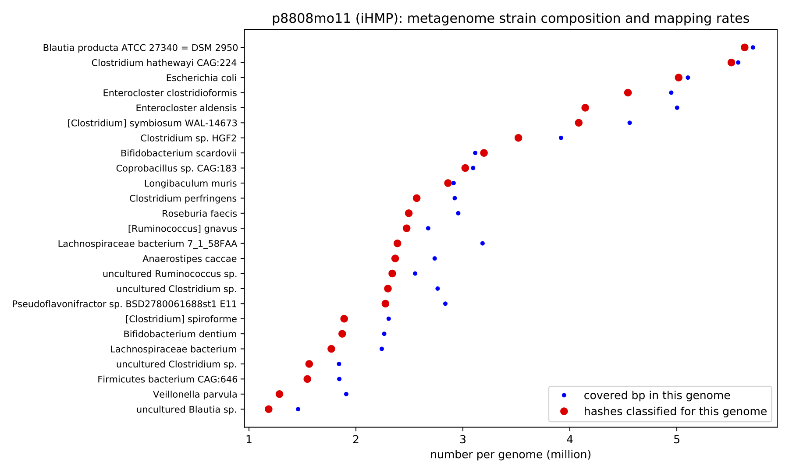

# Welcome to genome-grist!

<!-- CTB: this is doc/index.md in dib-lab/genome-grist -->

genome-grist is software that automates a number of tedious metagenome tasks related to reference-based analyses of Illumina metagenomes. Specifically, genome-grist will download public metagenomes from the SRA, preprocess them, and use [sourmash `gather`](https://sourmash.bio) to identify reference genomes for the metagenome. It will then download the reference genomes, map reads to them, and summarize the mapping in a variety of ways.

## Quickstart

Please see [a genome-grist quickstart](quickstart.md).

## Example figures and output

Here is the strain composition of a gut microbiome (iHMP).  This
figure was autogenerated by genome-grist; the metagenome and all
relevant genomes were downloaded and processed automatically.



## Configuring genome-grist

Please see [Configuring a genome-grist project](configuring.md).

## Running genome-grist

You can run genome-grist on a config file like so:

```
genome-grist run <config file> <target> [ <target> ... ]
```

The main three top-level targets are:

* `summarize_gather` - summarize metagenome contents using sourmash & k-mers
* `summarize_mapping` - summarize metagenome contents using mapping
* `summarize_tax` - summarize metagenome contents using k-mer-based taxonomy

These all produce reports in the `reports/` subdir of the configured output dir.

You can print out a list of documented targets by omitting the target altogether:
```
genome-grist run <config file>
```

genome-grist has many undocumented intermediate targets. You can print them all out by using `run` with the target `print_rules`
```
genome-grist run <config file> print_rules
```

## Additional information

### Preprints and publications

genome-grist was used extensively in the preprint [Lightweight compositional analysis of metagenomes with FracMinHash and minimum metagenome covers](https://dib-lab.github.io/2020-paper-sourmash-gather/), Irber et al., 2022.

For now, Irber et al., 2022 is the primary citation for genome-grist. Any use of genome-grist should be cited as follows:

> **Lightweight compositional analysis of metagenomes with FracMinHash and minimum metagenome covers.**
> 
> Luiz Carlos Irber, Phillip T Brooks, Taylor E Reiter, N Tessa Pierce-Ward, Mahmudur Rahman Hera, David Koslicki, C. Titus Brown.
> 
> bioRxiv 2022.01.11.475838; doi: https://doi.org/10.1101/2022.01.11.475838 

### Resource requirements

**Disk space:** genome-grist makes about 4-5 copies of each SRA metagenome.

**Memory:** the genbank search step on all of genbank takes ~120 GB of RAM. On GTDB, it's much, much less. Other than that, the other steps are all under 10 GB of RAM (unless you adjust `metagenome_trim_memory` upwards, which may be needed for complex metagenomes).

**Time:** This is largely dependent on the size of the metagenome; 100m reads takes a few hours. The processing of multiple data sets can be done in parallel with `-j`, as well, although you probably want to specify resource limits. For example, here is the command that we use on our HPC:
```
genome-grist run <config> -k --resources mem_mb=145000 -j 16
```
to run in 150GB of RAM, which will run at most one Genbank search at a time.

### Support and help

We like to support our software!

That having been said, genome-grist is still in beta. Please be patient and kind :).

Please ask questions and add comments [on the github issue tracker for genome-grist](https://github.com/dib-lab/genome-grist/issues).

### Why the name `grist`?

'grist' is in the sourmash family of names (sourmash, wort, distillerycats, etc.) See [Grist in Wikipedia](https://en.wikipedia.org/wiki/Grist).

(It is not named for the [computing grist](https://en.wikipedia.org/wiki/Grist_(computing))!)

### Installing in developer mode

You can run genome-grist from a working directory (e.g. a clone of the git repository) by using pip to install it in editable mode:
```
pip install -e .
```
in which case your genome-grist installation will track changes and updates in the working directory.

Or you can pip install the latest version from Github like so:
```
pip install git+https://github.com/dib-lab/genome-grist.git
```

---

[CTB](https://twitter.com/ctitusbrown/) Jan 15, 2022
